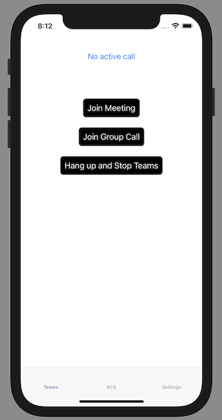

# Quickstart: Add Teams Embed to your iOS app

For full instructions on how to build this code sample from scratch, look at [Quickstart: Add Teams Embed to your iOS app](https://docs.microsoft.com/en-us/azure/communication-services/quickstarts/meeting/getting-started-with-teams-embed?pivots=platform-iOS)

## Prerequisites

To complete this tutorial, you’ll need the following prerequisites:

- An Azure account with an active subscription. [Create an account for free](https://azure.microsoft.com/free/?WT.mc_id=A261C142F). 
- A Mac running [Xcode](https://go.microsoft.com/fwLink/p/?LinkID=266532), along with a valid developer certificate installed into your Keychain.
- A deployed Communication Services resource. [Create a Communication Services resource](https://docs.microsoft.com/en-us/azure/communication-services/quickstarts/create-communication-resource).
- A [User Access Token](https://docs.microsoft.com/en-us/azure/communication-services/quickstarts/access-tokens?pivots=programming-language-csharp) for your Azure Communication Service.
- Download the `Teams Embed Mobile` framework and uncompress it. It will contain **AzureMeetingUIClient.xcframework** and **TeamsAppSDK.xcframework** and localization package.

## Code Structure

- **./TeamsEmbediOSGettingStarted/ViewController.swift:** Contains core UI and logic for calling SDK integration.
- **./TeamsEmbediOSGettingStarted.xcodeproj:** Xcode project for the sample.

## Object model

The following classes and interfaces used in the quickstart handle some of the major features of the Azure Communication Services Teams Embed library:

| Name                                  | Description                                                  |
| ------------------------------------- | ------------------------------------------------------------ |
| MeetingUIClient | The MeetingUIClient is the main entry point to the Teams Embed library. |
| MeetingUIClientMeetingJoinOptions | MeetingUIClientMeetingJoinOptions are used for configurable options such as display name. |
| MeetingUIClientGroupCallJoinOptions | MeetingUIClientGroupCallJoinOptions are used for configurable options such as display name. |
| MeetingUIClientTeamsMeetingLinkLocator | MeetingUIClientTeamsMeetingLinkLocator is used to set the meeting URL for joining a meeting. |
| MeetingUIClientGroupCallLocator | MeetingUIClientGroupCallLocator is used for setting the group ID to join. |
| MeetingUIClientIconType | MeetingUIClientIconType is used to specify which icons could be replaced with app-specific icon. |
| MeetingUIClientCall | MeetingUIClientCall describes the call and provides APIs to control it. |
| MeetingUIClientCallState | The MeetingUIClientCallState is used to for reporting call state changes. The options are as follows: `connecting`, `waitingInLobby`, `connected`, and `ended`. |
| MeetingUIClientAudioRoute | MeetingUIClientAudioRoute is used for local audio routes like `Earpiece` or `SpeakerOn`. |
| MeetingUIClientLayoutMode | MeetingUIClientLayoutMode is used for allowing to select different in call UI modes. |
| MeetingUIClientAvatarSize | MeetingUIClientAvatarSize is an enum to denote different avatar sizes that can be requested by MeetingUIClientCallIdentityProvider. |
| MeetingUIClientCallDelegate | The MeetingUIClientDelegate is used to receive events, such as changes in call state. |
| MeetingUIClientCallIdentityProviderDelegate | The MeetingUIClientIdentityProviderDelegate is used to map user details to the users in a meeting. |
| MeetingUIClientCallUserEventDelegate | The MeetingUIClientUserEventDelegate provides information about user actions in the UI. |
| MeetingUIClientCallRosterDelegate | The MeetingUIClientCallRosterDelegate provides information about call roster. |

## Before running sample code

1. Open an instance of PowerShell, Windows Terminal, Command Prompt or equivalent and navigate to the directory that you'd like to clone the sample to.
2. `git clone https://github.com/Azure-Samples/teams-embed-ios-getting-started`
3. Run `pod install` in your project root.
4. Copy **AzureMeetingUIClient.xcframework** and **TeamsAppSDK.xcframework** provided in the release bundle to the `Frameworks` folder in the project root
5. Open **TeamsEmbediOSGettingStarted.xcworkspace**
6. Select development team under **Signing and Capabilities**.
7. With the **Access Token** procured in pre-requisites, in the **TeamsEmbediOSGettingStarted/AcsSdkManager.swift**, **TeamsEmbediOSGettingStarted/TeamsEmbedSdkManager.swift**  files, replace `<USER_ACCESS_TOKEN>`.
8. In the **TeamsEmbediOSGettingStarted/TeamsEmbedSdkManager.swift** file, replace `<MEETING_URL>` with your a Microsoft Teams meeting url.
9. In the **TeamsEmbediOSGettingStarted/TeamsEmbedSdkManager.swift** file, replace `<GROUP_ID>` with your a goup id UUID.

## Run the sample

You can build an run your app on iOS simulator by selecting **Product** > **Run** or by using the (&#8984;-R) keyboard shortcut.

1. With the **Access Token** procured in pre-requisites, Go to Settings tab paste the token in the Access Token textfield and Click Save.
2. Go to Settings tab paste the Microsoft Teams meeting url in the Teams Meeting URL textfield and Click Save.
3. Go to Settings tab paste the Group Id UUID in the Group Id textfield and Click Save.

